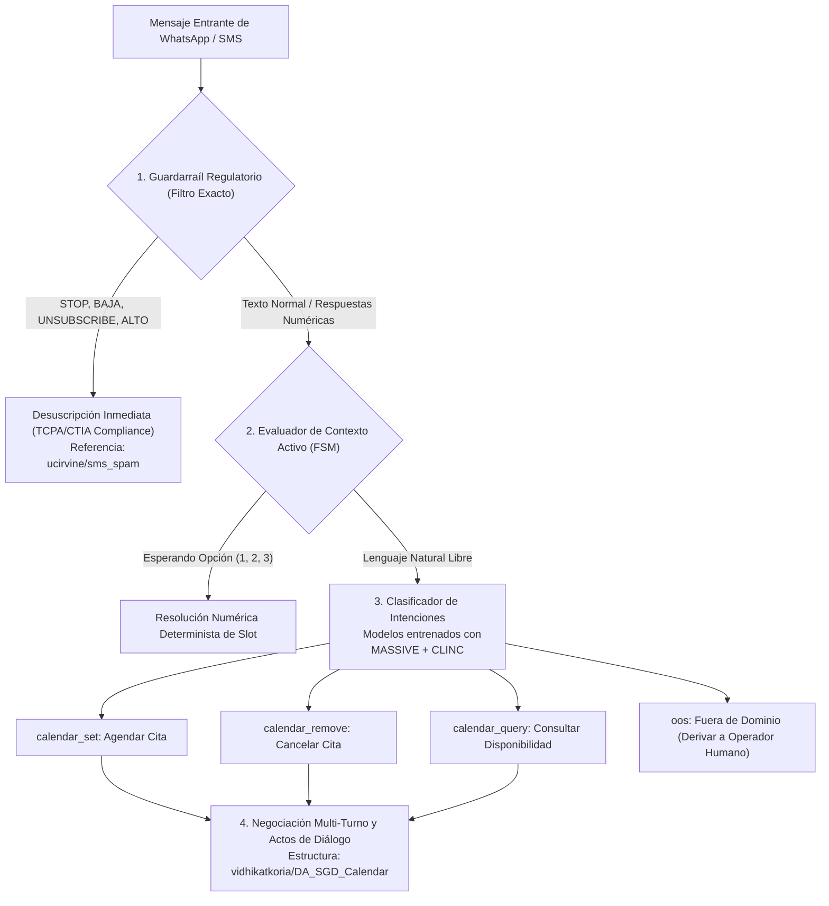

# Informe Técnico: Datasets de Hugging Face para AetherCal
**Autor:** Área de Datos e Investigación, AetherLogik  
**Fecha de Evaluación:** Septiembre 2026  
**Entorno de Ejecución:** `D:\aethercal`  
**Destino de Simulación:** `simulation/datasets/`

---

## 1. Resumen Ejecutivo y Alcance

Para el desarrollo del motor conversacional de **AetherCal** en canales de mensajería asíncrona (**WhatsApp** y **SMS**), se requiere clasificar con alta precisión intenciones transaccionales vinculadas a:
1. **Agendamiento, consulta y reprogramación de citas** (*Appointment Scheduling / Calendar Management*).
2. **Confirmación y cancelación explícita** (*Yes / No, Aprobación, Rechazo, Reagendar*).
3. **Manejo de directivas de exclusión publicitaria y regulatoria** (*Opt-Out / STOP / BAJA / CANCELAR* bajo estándares TCPA y CTIA).
4. **Respuestas ultra cortas y de baja entropía léxica** propias del chat conversacional: `"1"`, `"2"`, `"sí"`, `"ok"`, `"no"`, `"STOP"`, `"cancelar"`.

A través de la API pública de Hugging Face (`https://huggingface.co/api/datasets`) y los servicios de streaming de datos (`https://datasets-server.huggingface.co`), ejecutaste consultas sistemáticas en Python para auditar la oferta existente, validar esquemas de datos, inspeccionar muestras reales y determinar la viabilidad de transferir estos recursos al pipeline de simulación y entrenamiento de AetherCal.

---

## 2. Metodología de Exploración y Conectividad a la API

Se implementó un pipeline en Python (`simulation/scripts/query_hf_datasets.py`) que interactúa con dos capas de la infraestructura de Hugging Face:
- **API de Metadatos y Búsqueda (`GET https://huggingface.co/api/datasets`)**: Permite descubrir repositorios por palabras clave (`appointment`, `scheduling`, `conversational intent`, `spanish intent`, `whatsapp`, `sms opt-out`, `dialog act`), filtrando por número de descargas, *likes*, etiquetas de tarea (*task tags*) e idioma.
- **API de Acceso a Filas (`GET https://datasets-server.huggingface.co/rows`)**: Permite inspeccionar particiones (*splits*), configuraciones (*configs*), diccionarios de características (*features*) y filas reales en formato JSON sin necesidad de descargar gigabytes en memoria.

### Ejes de Búsqueda Ejecutados

| Eje Temático | Consultas API HF | Total Hallazgos Únicos | Datasets Filtrados Clave |
| :--- | :--- | :--- | :--- |
| **Citas y Calendario** | `appointment`, `scheduling`, `calendar` | 110 | `vidhikatkoria/DA_SGD_Calendar`, `AmazonScience/massive` |
| **Intenciones Conversacionales** | `intent`, `conversational intent`, `dialog act` | 890+ | `clinc/clinc_oos`, `sonos-nlu-benchmark/snips_built_in_intents` |
| **Mensajería SMS / WhatsApp** | `whatsapp`, `sms`, `opt-out`, `stop` | 180+ | `ucirvine/sms_spam`, `dbarbedillo/SMS_Spam_Multilingual...` |
| **NLU Multilingüe (Español/Inglés)** | `spanish intent`, `mtop`, `massive` | 140+ | `SetFit/amazon_massive_intent_es-ES`, `tasksource/mtop` |

---

## 3. Matriz Comparativa de los 5 Datasets Seleccionados

Tras auditar calidad formal, disponibilidad de esquemas, cobertura idiomática (Español / Inglés) y aplicabilidad para AetherCal, se priorizaron los siguientes 5 datasets:

| Dataset en Hugging Face | Idiomas | Volumen Registrado | Enfoque Principal en AetherCal | Relevancia Respuestas Cortas |
| :--- | :--- | :--- | :--- | :--- |
| **1. `AmazonScience/massive`** (`SetFit/...es-ES`) | 51 idiomas (ES nativo, EN) | 19,521 enunciados / idioma | Creación, consulta y eliminación de citas (`calendar_set`, `calendar_query`, `calendar_remove`) | Media-Alta (intents atómicos y slots de tiempo/fecha) |
| **2. `clinc/clinc_oos`** (`FastFit/clinc_150`) | Inglés (fácil translación) | 22,500 en dominio + 1,200 OOS | Clasificación de 150 intents con confirmación, cancelación y detección fuera de dominio | Alta (intents explícitos `cancel`, `yes`, `no`, `cancel_reservation`) |
| **3. `vidhikatkoria/DA_SGD_Calendar`** | Inglés (estructura pragmática universal) | Varios cientos de turnos multi-turno | Actos de diálogo (*Dialogue Acts*) en agendamiento conversacional turno a turno | Muy Alta (turnos como `"Yes, please."`, `"That's correct."`) |
| **4. `ucirvine/sms_spam`** / `dbarbedillo/SMS...` | Inglés y Español (22 idiomas) | 5,574 mensajes SMS | Sintaxis de cumplimiento regulatorio, disparadores de exclusión (*STOP, END, CANCEL*) | Crítica (validación de opt-out obligatorio y confirmación binaria) |
| **5. `tasksource/mtop`** (`WillHeld/mtop`) | 6 idiomas (ES, EN, DE, FR, HI, TH) | 100,000+ muestras | Semantic parsing y extracción de entidades jerárquicas en `CALENDAR` y `REMINDER` | Media (extracción formal de slots como `SL:DATE_TIME`, `SL:EVENT_NAME`) |

---

## 4. Análisis Detallado por Dataset e Inspección de Estructuras

### 4.1. Amazon MASSIVE (`SetFit/amazon_massive_intent_es-ES` / `AmazonScience/massive`)

#### Descripción Técnica
Creado por Amazon Science, MASSIVE es un corpus masivo de comprensión de lenguaje oral (SLU) traducido y localizado por lingüistas nativos en 51 idiomas. En su versión para español (`es-ES`), contiene 19,521 enunciados rigurosamente etiquetados en 18 escenarios y 60 intenciones.

#### Esquema de Datos
```json
{
  "id": "Value(dtype='string')",
  "label": "Value(dtype='int64')",
  "text": "Value(dtype='string')",
  "label_text": "Value(dtype='string')",
  "label_text_es": "Value(dtype='string')"
}
```

#### Ejemplos Reales Extraídos
- **`calendar_set` (conjunto de calendario):**
  - `"recuérdame a la una de la tarde"`
  - `"abierta memo agregar nota sobre mi reunión"`
  - `"recordatorios"`
  - `"recuérdale a mi amigo que consiga la tarea mañana"`
- **`calendar_query` (consulta de calendario):**
  - `"puedes confirmar que mi reunión de mañana ha sido cancelada"`
  - `"dime por favor los eventos actuales para el día"`
  - `"cuáles son los próximos recordatorios"`
  - `"a qué hora es la fiesta de ignacio"`
- **`calendar_remove` (quitar calendario):**
  - `"olly cancela la reunión de negocios del miércoles"`
  - `"elimina el evento boda de ricardo del próximo año"`
  - `"eliminar stand-up el viernes a las diez a. m."`
  - `"eliminar chat con juan"`
- **`datetime_query` (consulta de fecha y hora):**
  - `"que dia es hoy"`
  - `"que fecha es hoy"`
  - `"dime la hora"`

#### Diagnóstico para AetherCal
Es el recurso más sólido en Hugging Face para el clasificador de intenciones en español. Permite entrenar clasificadores ligeros de pocos parámetros (SetFit con `paraphrase-multilingual-MiniLM-L12-v2`) para reconocer inmediatamente la intención de agendar, cancelar o inspeccionar la disponibilidad en lenguaje coloquial.

---

### 4.2. CLINC 150 / OOS (`clinc/clinc_oos` y `FastFit/clinc_150`)

#### Descripción Técnica
Desarrollado por Larson et al. (EMNLP 2019), CLINC150 es el estándar de la industria para evaluar sistemas de diálogo ante 150 clases de intención equilibradas (100 muestras de entrenamiento por clase), integrando una clase especial *Out-of-Scope* (OOS) para detectar solicitudes inválidas o que exceden el dominio del bot.

#### Esquema de Datos
```json
{
  "text": "Value(dtype='string')",
  "intent": "ClassLabel(num_classes=151)"
}
```

#### Ejemplos Reales Extraídos

- **`calendar_update`:**
  - `"i need to add my doctor's appointment to my calendar for the first"`
  - `"i need to delete my doctor's appointment scheduled for march 15th from my calendar"`
  - `"write down appointment for tomorrow on my calendar"`
  - `"add my doctor appointment on march 25th at 3:00 to my calendar"`
  - `"delete the hair appointment i had scheduled on may 1st pleae"`
- **`cancel_reservation`:**
  - `"can you cancel the reservation for kyle's party at red lobster"`
  - `"cancel my reservation for dinner"`
  - `"tell the restaurant i cannot make it"`
  - `"something's come up so i need to cancel my reservation so now"`
  - `"can you undo the reservation"`
- **`confirm_reservation`:**
  - `"verify that i have reservations at chilis for john doe"`
  - `"check and confirm reservations at ruth chris for carol lee"`
- **`cancel` (cancelación pura):**
  - `"please cancel what you are doing, i've changed my mind"`
  - `"never mind, cancel that"`
  - `"stop working on it, i need something else"`
  - `"forget it, i do not need it anymore"`
- **`yes` (afirmación pura):**
  - `"yep"`
  - `"that is affirmative"`
  - `"what you just said is true"`
- **`no` (negación pura):**
  - `"no, that's incorrect"`
  - `"that's not true"`
  - `"no way"`
  - `"not really"`

#### Diagnóstico para AetherCal
Esencial para calibrar el umbral de certidumbre del bot. Evita falsos positivos cuando el usuario escribe consultas generales que nada tienen que ver con su cita, y provee variantes semánticas exhaustivas para cancelaciones y respuestas afirmativas/negativas.

---

### 4.3. Schema-Guided Dialogue: Calendar (`vidhikatkoria/DA_SGD_Calendar`)

#### Descripción Técnica
Derivado del corpus Google SGD (Schema-Guided Dialogue), este dataset aísla exclusivamente las conversaciones del dominio `Calendar` y descompone cada interacción en actos de diálogo (*Dialogue Acts*), identificando si el turno corresponde al usuario (`speaker: 0`) o al agente (`speaker: 1`).

#### Esquema de Datos
```json
{
  "domain": "Value(dtype='string')",
  "context": "Value(dtype='string')",
  "response": "Value(dtype='string')",
  "act": "Value(dtype='int64')",
  "speaker": "Value(dtype='int64')"
}
```

#### Mapeo de Actos de Diálogo y Muestras Reales
| Act ID | Acto Pragmático | Locutor | Ejemplo de Turno Extraído | Contexto Previo (`<SEP>`) |
| :--- | :--- | :--- | :--- | :--- |
| **0** | `AFFIRM` | Usuario | `"Yes, please."` | `Agent: ...you are free at 7:30 pm. <SEP> Agent: Do you want me to add any event?` |
| **1** | `CONFIRM` | Usuario | `"That's correct."` | `Agent: Please confirm that you want to add an event titled Reservation...` |
| **2** | `CLOSE` | Agente | `"Have a great day!"` | `User: Thanks for your help. <SEP> Agent: Can I still help? <SEP> User: No.` |
| **3** | `INFORM` | Usuario | `"Put Bedtime as the event title."` | `Agent: What should I call the event?` |
| **10** | `REQUEST` | Agente | `"Which date would you like to find availability for?"` | `User: Please show me my availability.` |
| **12** | `FOLLOW_UP`| Agente | `"Is there anything else I can assist you with?"` | `User: Awesome!` |
| **13** | `ACKNOWLEDGE` | Usuario | `"Sounds great."` | `Agent: There's 1 empty slot on your calendar tomorrow starting at 8 am.` |
| **14** | `THANK_YOU` | Usuario | `"Thanks for the help!"` | `Agent: Okay, I've added it to your calendar.` |

#### Diagnóstico para AetherCal
AetherCal en WhatsApp opera mediante una máquina de estados finitos (FSM) o un grafo conversacional. Este dataset ilustra formalmente cómo transicionar de `REQUEST` a `INFORM`, de `CONFIRM` a `AFFIRM`, y cómo procesar cierres de interacción con cortesía sin reiniciar el ciclo de agendamiento.

---

### 4.4. SMS Collection & Compliance Patterns (`ucirvine/sms_spam` y edición multilingüe)

#### Descripción Técnica
El corpus clásico de SMS de UC Irvine (Almeida et al.) y su versión traducida multilingüe (`dbarbedillo/SMS_Spam_Multilingual_Collection_Dataset`) recopilan 5,574 mensajes de mensajería móvil real. Aunque su etiqueta nativa es `spam` vs `ham`, constituye la fuente empírica pública más rica de **instrucciones de exclusión (*Opt-Out*) y respuestas guiadas por palabras clave**.

#### Esquema de Datos
```json
{
  "sms": "Value(dtype='string')",
  "label": "Value(dtype='int64')",
  "text_es": "Value(dtype='string')"
}
```

#### Evidencias Reales de Cumplimiento y Palabras Clave
1. **Mandatos de Opt-Out (STOP / CANCEL):**
   - `"Text FA to 87121 to receive entry question... Text STOP to cancel"`
   - `"SIX chances to win CASH!... Reply HL 4 info"`
   - `"SMS. ac Sptv: ... Correct or Incorrect? End? Reply END SPTV"`
2. **Confirmación Binaria Guiada:**
   - `"Thanks for your subscription... Please confirm by replying YES or NO. If you reply NO you will not be charged"`
3. **Respuestas Cortas e Informales:**
   - `"Yup next stop."`
   - `"Ok lar... Joking wif u oni..."` $\rightarrow$ Traducido a ES: `"Bueno, la broma, la broma..."`
   - `"Nah I don't think he goes to usf..."` $\rightarrow$ Traducido a ES: `"No creo que vaya a la USF, pero vive aquí."`

#### Diagnóstico para AetherCal
En plataformas de mensajería empresarial reguladas (Twilio, WhatsApp Business Cloud API), recibir la palabra `"STOP"`, `"ALTO"`, `"BAJA"` o `"CANCEL"` exige desuscribir al número telefónico de inmediato en la base de datos para evitar multas de telecomunicaciones (TCPA). Este dataset provee los patrones lingüísticos reales que acompañan a estas directivas.

---

### 4.5. Meta MTOP (`tasksource/mtop` / `WillHeld/mtop`)

#### Descripción Técnica
Creado por Meta AI (Li et al., 2021), MTOP está diseñado para el análisis semántico de tareas en asistentes virtuales en 6 idiomas (incluyendo Español e Inglés). Contiene más de 100,000 instancias anotadas tanto con intención plana como con árboles lógicos estructurados (*logical forms*).

#### Esquema de Datos
```json
{
  "idx": "Value(dtype='string')",
  "question": "Value(dtype='string')",
  "intent": "Value(dtype='string')",
  "domain": "Value(dtype='string')",
  "lang": "Value(dtype='string')",
  "spans": "Value(dtype='string')",
  "logical_form": "Value(dtype='string')"
}
```

#### Ejemplos en los Dominios `CALENDAR`, `REMINDER` y `MESSAGING`
- **Intención:** `IN:CREATE_EVENT`
  - *Logical Form:* `[IN:CREATE_EVENT [SL:NAME_EVENT cita con el médico ] [SL:DATE_TIME mañana a las cuatro ] ]`
- **Intención:** `IN:DELETE_EVENT`
  - *Logical Form:* `[IN:DELETE_EVENT [SL:DATE_TIME el viernes ] [SL:NAME_EVENT dentista ] ]`
- **Intención:** `IN:GET_EVENT`
  - *Logical Form:* `[IN:GET_EVENT [SL:DATE_TIME hoy ] ]`
- **Intención:** `IN:SEND_MESSAGE`
  - *Logical Form:* `[IN:SEND_MESSAGE [SL:RECIPIENT mamá ] [SL:CONTENT llego tarde ] ]`

#### Diagnóstico para AetherCal
Permite implementar o validar modelos de extracción de entidades (*Named Entity Recognition / Slot Filling*) para capturar parámetros críticos de la cita (`fecha`, `hora`, `especialista`, `servicio`) a partir del mensaje del usuario antes de emitir la confirmación final.

---

## 5. Evaluación Crítica de Respuestas Cortas de Mensajería

Un hallazgo crucial de la investigación en los repositorios de Hugging Face es que **la mayoría de los datasets de NLP convencionales asumen oraciones completas y gramaticalmente bien formadas**. Sin embargo, el comportamiento real de usuarios en WhatsApp y SMS se caracteriza por enunciados de 1 a 3 tokens:

| Token / Entrada de Usuario | Categoría Funcional en AetherCal | Presencia en Datasets Evaluados | Reto Técnico y Solución Recomendada |
| :--- | :--- | :--- | :--- |
| `"1"` o `"2"` | Selección de slot o confirmación de opción de horario | **Ausente** en MASSIVE y CLINC; implícito en SGD como slot value | **Solución:** No debe procesarse mediante embeddings semánticos libres. Debe ser capturado por la capa de reglas context-aware de la FSM de AetherCal cuando el bot ofrece una lista numerada. |
| `"STOP"` / `"BAJA"` / `"CANCELAR"` | Directiva regulatoria de exclusión (*Opt-Out*) | **Presente** en `ucirvine/sms_spam` como directiva de operador | **Solución:** Guardarraíl determinista de prioridad cero (*Zero-priority interceptor*). Antes de invocar cualquier modelo de NLU o LLM, un analizador léxico exacto (`Regex / Exact Match`) debe ejecutar el opt-out en la base de datos. |
| `"sí"` / `"yes"` / `"claro"` / `"dale"` | Confirmación afirmativa de cita | **Presente** en CLINC (`intent: yes`) y SGD (`act: 0 AFFIRM`) | **Solución:** Clasificador híbrido: coincidencia rápida en diccionario de afirmaciones + modelo de intent binario si la respuesta contiene modificadores (ej. *"sí por favor a las 4"*). |
| `"cancelar"` / `"no puedo ir"` | Cancelación transaccional de cita existente | **Presente** en MASSIVE (`calendar_remove`) y CLINC (`cancel_reservation`) | **Solución:** El clasificador de intenciones lo distingue claramente del opt-out comercial: *"cancelar cita"* libera el horario en Google Calendar/Outlook, mientras que *"STOP"* desactiva las comunicaciones hacia ese teléfono. |

---

## 6. Recomendaciones de Integración para AetherCal

Con base en la inspección de estos recursos, se recomienda la siguiente arquitectura de datos para el módulo de simulación (`simulation/`):



### Plan de Acción Concreto:
1. **Generación de Dataset Sintético Híbrido (`simulation/datasets/aethercal_benchmark.jsonl`):**
   - Extraer los subconjuntos `calendar_set`, `calendar_query` y `calendar_remove` de `SetFit/amazon_massive_intent_es-ES`.
   - Traducir e integrar las clases `yes`, `no`, `cancel_reservation` y `confirm_reservation` de `clinc/clinc_oos`.
   - Inyectar 200 variaciones de respuestas cortas sintéticas (`"1"`, `"2"`, `"opción 1"`, `"la primera"`, `"confirmo"`, `"sí"`, `"cancelar"`, `"STOP"`).
2. **Pruebas de Simulación de Carga y Precisión:**
   - Emplear `query_hf_datasets.py` para alimentar los escenarios de prueba en `simulation/aethercal_sim`.
   - Evaluar la tasa de acierto (*F1-score*) distinguiendo específicamente entre cancelación de cita de calendario (`calendar_remove`) y baja comercial de mensajería (`opt_out`).

---

## 7. Archivos de Soporte Creados

- **Script de Extracción Automatizada:** `simulation/scripts/query_hf_datasets.py`
- **Hallazgos Estructurados en JSON:** `simulation/datasets/extracted_findings.json`
- **Muestras Inspeccionadas de CLINC:** `simulation/datasets/clinc_real_samples.json`
- **Muestras Inspeccionadas de MASSIVE:** `simulation/datasets/massive_es_samples.json`
- **Informe Técnico:** `simulation/datasets/hf_datasets_report.md`
